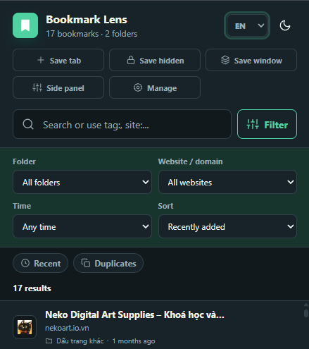

# Bookmark Lens — Chrome Bookmark Manager Extension

> A powerful Chrome extension to **search, filter, tag, and organize** your entire bookmark library — with fuzzy search, duplicate detection, a broken-link checker, workspaces, and a full-page dashboard.
>
> *Tiện ích Chrome giúp tìm, lọc, gắn tag và tổ chức toàn bộ thư viện bookmark: tìm gần đúng, phát hiện trùng lặp, kiểm tra liên kết hỏng, workspace và dashboard toàn màn hình.*

**Keywords:** chrome extension, bookmark manager, bookmarks organizer, duplicate bookmark finder, broken link checker, tab manager, Manifest V3, productivity — *trình quản lý bookmark, tổ chức bookmark, quản lý tab.*

Developed by **Kenzy**.

---

## 🌐 Ngôn ngữ / Language

- [Tiếng Việt](#-tiếng-việt)
- [English](#-english)

---

## 🇻🇳 Tiếng Việt

Tiện ích Chrome giúp tìm, lọc, tổ chức và bảo trì toàn bộ thư viện bookmark. Popup phục vụ thao tác nhanh; Side Panel hỗ trợ làm việc song song; trang quản lý toàn màn hình dành cho các công việc lớn.

### Cài đặt

1. Mở `chrome://extensions/` trong Google Chrome.
2. Bật **Chế độ dành cho nhà phát triển**.
3. Chọn **Tải tiện ích đã giải nén**.
4. Chọn thư mục `bookmark-lens` này.

### Tính năng chính

- Tìm gần đúng và cú pháp nâng cao: `site:`, `folder:`, `tag:`, `status:`, `is:`.
- Lọc website bằng dropdown hoặc bấm trực tiếp vào domain trên từng bookmark.
- Sắp xếp theo tên, thư mục, thời gian, lượt truy cập, lần truy cập gần nhất hoặc thứ tự thủ công.
- Chọn nhiều để mở, sao chép, di chuyển, đánh dấu đã đọc hoặc xóa.
- Kéo bookmark vào thư mục và kéo lên vị trí mong muốn.
- Phát hiện bản trùng, đề xuất bản nên giữ và tạo bản phục hồi trước khi xóa.
- Kiểm tra liên kết hỏng/chuyển hướng sau khi người dùng cấp quyền website tùy chọn.
- Tag có màu, ghi chú, ghim, danh sách đọc sau và ngày đọc gần nhất.
- Lưu tab hiện tại hoặc toàn bộ cửa sổ; cảnh báo khi URL đã tồn tại.
- Side Panel để tìm, lọc domain, mở workspace và lưu tab mà không rời trang hiện tại.
- Luật tự động sắp xếp theo domain, tiêu đề, URL, thư mục hoặc tag; có thể tự áp khi lưu bookmark mới.
- Xem trước bookmark sẽ bị di chuyển/gắn tag trước khi áp dụng rule hàng loạt.
- Mẫu luật sẵn cho GitHub, YouTube, tài liệu và đọc sau.
- Gợi ý tạo luật từ domain phổ biến và workspace để lưu bộ lọc hay dùng.
- Command palette `Ctrl/⌘ + Shift + K`, trợ giúp nhanh, onboarding lần đầu và preview website trong màn hình chỉnh sửa.
- Chuyển ngôn ngữ giao diện giữa Tiếng Việt và English trong popup, Side Panel và dashboard.
- Đồng bộ tùy chọn qua `chrome.storage.sync`; metadata tag/màu/note/trạng thái có thể sync nếu còn trong giới hạn Chrome Sync, nếu vượt sẽ giữ cục bộ.
- Chế độ gọn, lazy favicon, danh sách ảo hóa, IndexedDB search index và tùy chỉnh số dòng tải thêm cho thư viện lớn.
- Kéo thả bookmark vào thư mục ngay trong Side Panel.
- Workspace lưu bộ lọc và có thể mở lại toàn bộ tab đã lưu trong workspace.
- Kho ẩn mã hóa bằng mật khẩu để lưu trang riêng tư không xuất hiện trong Chrome bookmarks.
- Dashboard thống kê tên miền, thư mục và hoạt động theo tháng.
- Xuất/nhập JSON đầy đủ hoặc HTML tương thích trình duyệt.
- Menu chuột phải và phím tắt `Ctrl+Shift+Y`, `Alt+Shift+B`; khi lưu bằng phím tắt sẽ có badge/notification báo kết quả.
- Giao diện sáng/tối; dữ liệu xử lý cục bộ, không có máy chủ bên ngoài.

### Cú pháp tìm kiếm

- `site:github.com`: lọc theo tên miền.
- `folder:Công việc`: lọc theo tên thư mục.
- `tag:học tập`: lọc theo tag.
- `status:unread` hoặc `status:broken`: trạng thái đọc/liên kết.
- `is:pinned` hoặc `is:duplicate`: bookmark ghim/trùng lặp.

### Quyền sử dụng

- `bookmarks`: đọc và thay đổi bookmark theo thao tác của người dùng.
- `storage`: lưu tag, ghi chú, trạng thái và tùy chọn.
- `history`: hỗ trợ sắp xếp theo lượt/lần truy cập.
- `tabs`: lưu tab hiện tại hoặc toàn bộ cửa sổ.
- `contextMenus`: cung cấp menu chuột phải.
- `sidePanel`: mở Bookmark Lens trong panel cạnh của Chrome.
- `notifications`: báo kết quả khi lưu bookmark bằng phím tắt hoặc menu chuột phải.
- Quyền truy cập `http://*/*` và `https://*/*` là **tùy chọn**, chỉ được hỏi khi bắt đầu kiểm tra liên kết.

> Nếu `Alt+Shift+B` không chạy sau khi cài lại, mở `chrome://extensions/shortcuts` và kiểm tra shortcut **Lưu trang hiện tại vào Bookmark Lens** đã được gán đúng chưa.

---

## 🇬🇧 English

**Bookmark Lens** is a Chrome extension that helps you search, filter, organize, and maintain your entire bookmark library. Use the **popup** for quick actions, the **Side Panel** to work side-by-side with any page, and the **full-page dashboard** for large clean-up jobs.

### Installation

1. Open `chrome://extensions/` in Google Chrome.
2. Enable **Developer mode**.
3. Click **Load unpacked**.
4. Select this `bookmark-lens` folder.

### Key features

- **Fuzzy search** with advanced query syntax: `site:`, `folder:`, `tag:`, `status:`, `is:`.
- Filter by website via a dropdown or by clicking a domain on any bookmark.
- Sort by name, folder, date, visit count, last visit, or manual order.
- Multi-select to open, copy, move, mark as read, or delete.
- Drag bookmarks into folders and reorder them.
- **Duplicate detection** — suggests which copy to keep and creates a restore point before deleting.
- **Broken-link / redirect checker** (after you grant optional site permission).
- Colored tags, notes, pins, a read-later list, and last-read dates.
- Save the current tab or the whole window; warns when a URL already exists.
- Side Panel to search, filter domains, open workspaces, and save tabs without leaving the current page.
- **Auto-sort rules** by domain, title, URL, folder, or tag — optionally applied when new bookmarks are saved.
- Preview which bookmarks will be moved/tagged before applying bulk rules.
- Built-in rule templates for GitHub, YouTube, docs, and read-later.
- Rule suggestions from popular domains, plus workspaces to save favorite filters.
- Command palette (`Ctrl/⌘ + Shift + K`), quick help, first-run onboarding, and website preview in the editor.
- Switch UI language between **Vietnamese and English** in the popup, Side Panel, and dashboard.
- Sync preferences via `chrome.storage.sync`; tag/color/note/status metadata syncs within Chrome Sync limits, and stays local if it exceeds them.
- Performance for large libraries: compact mode, lazy favicons, virtualized lists, an IndexedDB search index, and configurable load-more batch size.
- Drag-and-drop bookmarks into folders directly in the Side Panel.
- Workspaces save filter sets and can reopen all tabs stored in them.
- **Encrypted, password-protected vault** for private pages that never appear in Chrome bookmarks.
- Dashboard with statistics by domain, folder, and monthly activity.
- Full JSON export/import, or browser-compatible HTML.
- Right-click menu and shortcuts (`Ctrl+Shift+Y`, `Alt+Shift+B`), with a badge/notification confirming saves.
- Light/dark theme; all data is processed **locally with no external server**.

### Search syntax

- `site:github.com` — filter by domain.
- `folder:Work` — filter by folder name.
- `tag:study` — filter by tag.
- `status:unread` / `status:broken` — read or link status.
- `is:pinned` / `is:duplicate` — pinned or duplicate bookmarks.

### Permissions

- `bookmarks` — read and modify bookmarks based on your actions.
- `storage` — store tags, notes, status, and preferences.
- `history` — sort by visit count / last visit.
- `tabs` — save the current tab or the whole window.
- `contextMenus` — provide the right-click menu.
- `sidePanel` — open Bookmark Lens in Chrome's side panel.
- `notifications` — confirm saves made via shortcut or context menu.
- `http://*/*` and `https://*/*` are **optional**, requested only when you start the link checker.

> If `Alt+Shift+B` doesn't work after reinstalling, open `chrome://extensions/shortcuts` and check that the **Save current page to Bookmark Lens** shortcut is assigned.

---

## 🗂️ Project structure

- `manifest.json` — Chrome Extension Manifest V3 config.
- `popup.html` — popup UI.
- `sidepanel.html` — Side Panel UI.
- `dashboard.html` — full-page manager.
- `core.js` — shared data and utilities.
- `i18n.js` — Vietnamese/English UI switching.
- `background.js` — context menu, shortcuts, and metadata cleanup.

## 🔒 Privacy

All data is processed locally. There is no external server. See [PRIVACY.md](PRIVACY.md).

## 📄 License

Developed by **Kenzy**. See the repository for license details.
